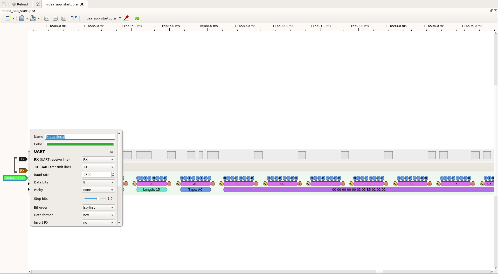
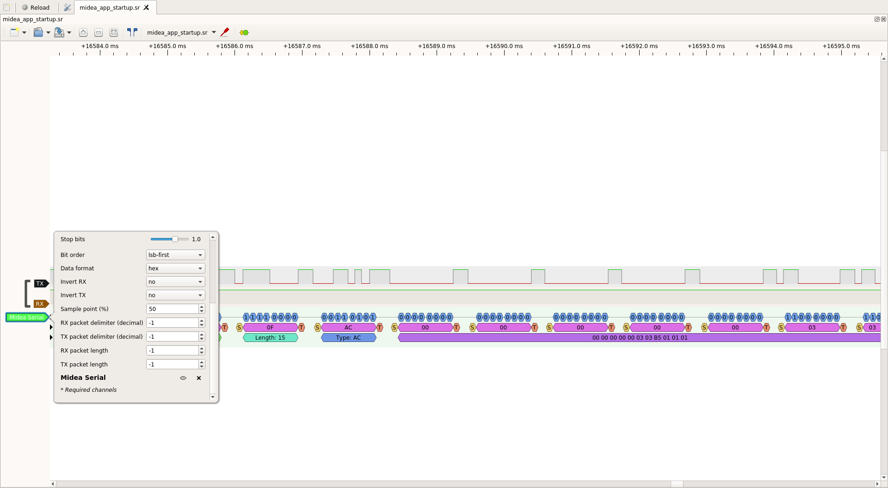

A sigrok decoder for Midea Serial protocol. WIP

Check https://sigrok.org/wiki/Protocol_decoder_HOWTO to install it on your system. For instance, adding a link to the decoder directory on $HOME/.local/share/libsigrokdecode/decoders works fine.

```
$> cd $HOME/.local/share/libsigrokdecode/decoders
/home/dlobato/.local/share/libsigrokdecode/decoders
$> ln -s <workspace>/sigrok-midea-serial-decoder/midea_serial .
$> ls -l
lrwxrwxrwx 1 dlobato dlobato 73 jul 14 11:18 midea_serial -> <workspace>/sigrok-midea-serial-decoder/midea_serial
```

To use it stack the decoder to the uart decoder like this:

